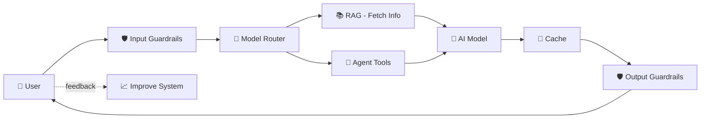

# 📖 AI Engineering by Chip Huyen — Book Summary

> **Source:** Video summary of *AI Engineering* by Chip Huyen (~800 pages)
> **Video link:** https://www.youtube.com/watch?v=JV3pL1_mn2M
> **Field:** AI Engineering — one of the fastest-growing engineering disciplines
> **Salary range:** $300,000+

---

## 🧠 Summary (Explained Like You're New to AI)

Hey! Let me break this down super simple, like we're sitting at a table with crayons. No scary tech words without explaining them first.

---

### 🍼 First: What even IS AI Engineering?

Imagine there's a **giant robot brain** already built by big companies (OpenAI, Google). It knows a LOT about the world.

- **Old way (Machine Learning Engineer):** Build the robot brain from scratch. Very hard. Takes years.
- **New way (AI Engineer):** Take the *already-built* robot brain and teach it to do YOUR specific job (like being a customer support helper, or a coding buddy).

That's it. **AI Engineers use pre-made brains and shape them for real-world jobs.** And yes, they get paid a LOT ($300k+) because it's a new, hot skill.

---

### 🧱 The Building Blocks (In Baby Steps)

#### 1. Foundation Models = The Giant Robot Brain

These are HUGE AI models (like ChatGPT) trained by reading almost the entire internet.

- They learn by **playing a fill-in-the-blank game** with billions of sentences. This is called **self-supervision** (no humans needed to teach it — it teaches itself).
- **Problem:** The internet has junk (fake news, bad stuff), so companies filter it.
- **Fun fact:** ~50% of training data is in English, so the AI is better at English than other languages.

**Transformers** are the "engine" inside these brains. Think of them like a super-smart reader that can look at ANY word in your question at the same time (instead of one-by-one). That's why they're fast and smart.

---

#### 2. How the AI "Chooses" Words (Sampling)

When AI writes an answer, it doesn't KNOW the answer — it **guesses the next word based on probability**.

- **Temperature** = creativity knob 🎛️
  - Low (0) = boring, predictable, safe
  - High (1) = creative, wild, sometimes wrong
- This is why AI sometimes **hallucinates** (makes stuff up confidently). It's just guessing!

---

#### 3. Evaluation = Grading the AI's Homework 📝

How do you know if the AI is doing a good job? This is HARD because:
- There's no single "correct" answer (like, what's the "right" poem?)
- The AI is a black box (you can't peek inside)

**Ways to grade it:**
- **Exact match:** Did it get the right answer? (For math, yes/no questions)
- **Similarity:** Does the answer LOOK like the correct one?
- **AI as a Judge:** Use ANOTHER AI to grade the first AI. (Cheaper than humans, works surprisingly well!)

---

#### 4. Picking a Model = Shopping for a Brain 🛒

Should you:
- **Use someone else's brain** (OpenAI API) → Easy, but costs money and less control
- **Host your own brain** (open-source model) → More work, but private and flexible

Think about: **privacy, cost, speed, and how good it needs to be.**

---

#### 5. Prompt Engineering = Talking to the AI the Right Way 💬

This is the EASIEST way to make AI do what you want — just **write better instructions**.

**Tricks that work:**
- ✅ Be super clear: "Score this essay from 1–10 using X rules"
- ✅ Give examples: "Here's a good answer: ___. Now do the same for..."
- ✅ Ask it to think step-by-step ("Chain of Thought")
- ✅ Give it a role: "You are a friendly teacher explaining to a 5-year-old"

**Warning:** Bad people can trick your AI (prompt injection attacks). Add safety rules!

---

#### 6. RAG = Giving AI a Textbook 📚

**RAG = Retrieval Augmented Generation**

The AI only knows what it was trained on (old info). RAG lets it **look things up** in YOUR documents before answering.

**Simple example:**
> You ask a company chatbot: "What's your return policy?"
> RAG finds the policy doc → gives it to the AI → AI answers using that doc.

Two steps:
1. **Store** your documents in chunks (like index cards)
2. **Search** for the right chunk when a question comes in

---

#### 7. Agents = AI with Tools 🛠️

An **agent** is an AI that can DO stuff, not just talk.

Give it tools like:
- 🔍 Web search
- 🧮 A calculator
- 📧 Email
- 💻 Code runner

**Example:** You ask "Book me a flight to Paris" → Agent searches flights → picks one → books it.

**Warning:** Agents can mess up big time (they take multiple steps, errors add up). Always plan first, then act.

---

#### 8. Fine-Tuning = Sending the AI to Specialty School 🎓

You take the general AI brain and **retrain it** on your specific data so it gets really good at your job (e.g., medical answers, legal writing).

- **Expensive** (needs lots of computer power)
- **Only do it if prompt engineering + RAG aren't enough**
- **LoRA** = a cheap trick to fine-tune without needing a supercomputer

**Rule of thumb:**
- Missing info problem? → Use RAG
- Wrong style/format problem? → Fine-tune

---

#### 9. Data = The Secret Sauce 🍝

**"Garbage in, garbage out."** Your AI is only as good as the data you feed it.

- Quality > Quantity (100 great examples > 10,000 bad ones)
- Start with ~50 examples and see if it helps
- Data must be: relevant, consistent, diverse, and legal to use

---

#### 10. Inference Optimization = Making It Fast & Cheap 🏎️

**Inference** = the AI actually running and answering.

Ways to speed it up:
- **Quantization:** Shrink the model (like compressing a photo — smaller but still works)
- **Caching:** Save common answers so you don't recompute them
- **Batching:** Answer multiple questions at once
- **Better hardware:** Use GPUs (they're built for this)

---

#### 11. Putting It All Together — Real App Architecture 🏗️

A real AI app looks like this (built up over time):

Add these pieces as you grow:
1. **Context** (RAG, tools)
2. **Guardrails** (safety filters)
3. **Router** (pick the right AI for each job)
4. **Cache** (save time & money)
5. **Monitoring** (watch for problems)
6. **User feedback** (thumbs up/down — this is GOLD for improving)

---

### 🎯 TL;DR — The Whole Field in 5 Sentences

1. AI Engineers take **pre-built giant AI models** and shape them for real jobs.
2. They start simple with **prompt engineering** (just talking to the AI better).
3. If the AI needs info it doesn't know → add **RAG** (give it documents to read).
4. If the AI needs to *do* stuff → build an **agent** (give it tools).
5. If it still isn't good enough → **fine-tune** it on your own data.

---

### 🚀 What Should YOU Do Next?

Since you're just starting:

1. **Play with ChatGPT/Claude** — try prompt engineering yourself
2. **Learn Python basics** (it's the language of AI)
3. **Try a simple RAG project** — feed a PDF to an AI and ask questions
4. **Learn one framework**: LangChain or LlamaIndex (they make this stuff easier)
5. **Read the book** the video is based on: *AI Engineering by Chip Huyen* (the "bible" of this field)

You don't need to know all of this on day 1. Even senior engineers Google half of it. Just start building tiny projects and learn as you go. 🌱

---

## 📌 Key Chapters in the Book

| Chapter | Topic | Notes File |
|---------|-------|-----------|
| 1 | Foundation Models | [../01-foundation-models/notes.md](../01-foundation-models/notes.md) |
| 2 | Evaluation | [../02-evaluation/notes.md](../02-evaluation/notes.md) |
| 3 | Model Selection | [../03-model-selection/notes.md](../03-model-selection/notes.md) |
| 4 | Prompt Engineering | [../04-prompt-engineering/notes.md](../04-prompt-engineering/notes.md) |
| 5 | RAG | [../05-rag/notes.md](../05-rag/notes.md) |
| 6 | Agents | [../06-agents/notes.md](../06-agents/notes.md) |
| 7 | Fine-Tuning | [../07-fine-tuning/notes.md](../07-fine-tuning/notes.md) |
| 8 | Dataset Engineering | [../08-dataset-engineering/notes.md](../08-dataset-engineering/notes.md) |
| 9 | Inference Optimization | [../09-inference-optimization/notes.md](../09-inference-optimization/notes.md) |
| 10 | Full Architecture | [../10-architecture/notes.md](../10-architecture/notes.md) |
