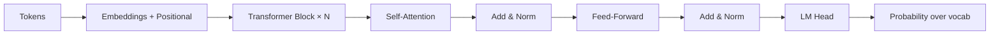

# 🔬 Foundation Models — Deep Dive

> Go beyond the beginner notes. Math, mechanics, and "why it works."

---

## 1. The Transformer, mechanically

### 1.1 Self-attention (the core idea)
For each token, we compute three vectors from its embedding $x$:
- **Query** $Q = x W_Q$ — "what am I looking for?"
- **Key** $K = x W_K$ — "what do I offer?"
- **Value** $V = x W_V$ — "what do I actually contribute?"

Attention weights:

$$
\text{Attention}(Q, K, V) = \text{softmax}\!\left(\frac{Q K^\top}{\sqrt{d_k}}\right) V
$$

Why divide by $\sqrt{d_k}$? To keep the softmax input variance ≈ 1 so gradients don't vanish.

### 1.2 Multi-head attention
Run $h$ attentions in parallel with different projections, concatenate, project again. Each head can specialize (syntax, coreference, position, etc.).

### 1.3 Positional information
Transformers are permutation-invariant without it. Options:
- **Sinusoidal** (original paper) — fixed.
- **Learned absolute** — GPT-2.
- **RoPE (Rotary)** — LLaMA, GPT-NeoX. Rotates Q/K by a position-dependent angle → extrapolates better.
- **ALiBi** — bias attention scores by distance.

### 1.4 Decoder-only vs encoder-decoder
- **Decoder-only** (GPT, LLaMA): causal mask, next-token prediction. Default for chat.
- **Encoder-decoder** (T5, BART): good for translation/summarization.
- **Encoder-only** (BERT): embeddings, classification.

---

## 2. Tokenization

- **BPE** (GPT): merge most frequent pairs.
- **WordPiece** (BERT): probabilistic merges.
- **SentencePiece / Unigram** (LLaMA, T5): language-agnostic, works on raw bytes.

**Why it matters:** tokenization affects cost (tokens = $), multilingual quality, and weird failures (numbers, code, unicode).

Experiment: `tiktoken.encoding_for_model("gpt-4o").encode("strawberry")` — count the tokens.

---

## 3. Training pipeline

1. **Pretraining** — next-token prediction on trillions of tokens.
2. **Supervised fine-tuning (SFT)** — instruction-following data.
3. **Preference tuning** — RLHF, DPO, or newer (KTO, IPO).
4. **Post-training tricks** — tool use, long-context, safety.

---

## 4. Scaling laws (Chinchilla, 2022)

Given compute $C$, optimal:
- Parameters $N \propto C^{0.5}$
- Tokens $D \propto C^{0.5}$
- Rule of thumb: **~20 tokens per parameter**.

Implication: many older models were undertrained. LLaMA-style models are "Chinchilla-optimal" or beyond.

---

## 5. Sampling & decoding

- **Greedy** — always argmax. Repetitive.
- **Temperature** $T$ — divide logits by $T$. $T \to 0$ = greedy, $T \to \infty$ = uniform.
- **Top-k** — sample from top-k tokens.
- **Top-p (nucleus)** — smallest set of tokens whose cumulative prob ≥ p.
- **Min-p** — dynamic threshold, better for reasoning.
- **Beam search** — good for translation, bad for open generation.

---

## 6. Key mental models

- LLMs are **probability distributions over next tokens**, nothing more.
- "Emergent abilities" are largely a metric artifact (Schaeffer et al. 2023).
- **In-context learning** ≈ gradient descent in the forward pass (informal analogy, see Von Oswald 2023).

---

## 7. Watch / read next

- Karpathy — *Let's build GPT from scratch* (video)
- 3Blue1Brown — *But what is a GPT?* (visual intuition)
- Sebastian Raschka — *Understanding Large Language Models* (blog)
- Paper: *Attention Is All You Need* (Vaswani 2017)
- Paper: *Training Compute-Optimal LLMs* (Hoffmann 2022, Chinchilla)

---

## 8. Diagram

