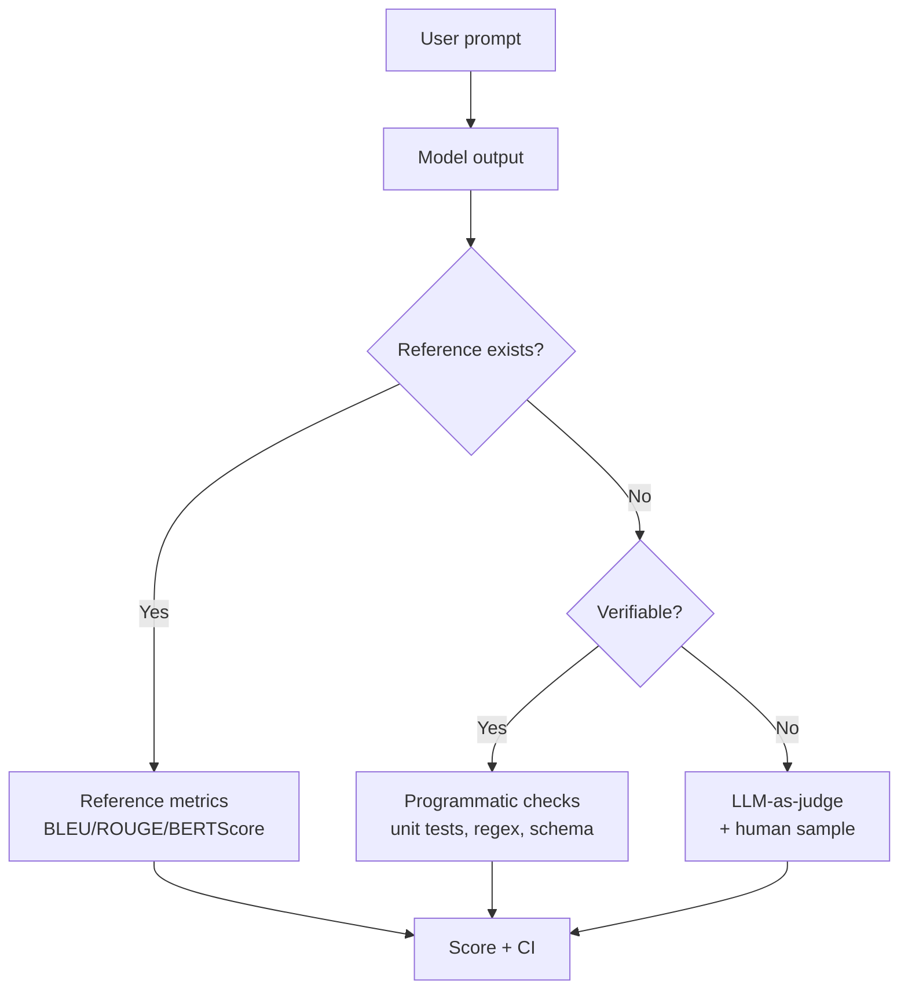

# 🔬 Evaluation — Deep Dive

> How do you know a model is actually good? This is the hardest problem in AI engineering.

---

## 1. Two eval regimes

| Regime | Example | Metric type |
|---|---|---|
| **Closed-ended** | Classification, multiple choice, code that compiles | Exact match, accuracy, F1, pass@k |
| **Open-ended** | Summarization, chat, creative writing | Reference-based, LLM-judge, human |

Rule: **make it closed-ended if you can.** Convert "is this summary good?" to "does it contain claims A, B, C?" (checklist eval).

---

## 2. Classic reference metrics

- **BLEU** — n-gram precision, brevity penalty. Translation.
- **ROUGE** — n-gram recall. Summarization.
- **BERTScore** — cosine similarity of BERT embeddings. Semantic.
- **METEOR** — synonyms + stemming.

Weakness: all penalize valid paraphrases. Use as directional signals, not truth.

---

## 3. Model-based (LLM-as-judge)

Ask a strong LLM to grade outputs. Two flavors:
- **Pointwise** — "rate 1-5."
- **Pairwise** — "A or B, which is better?" More reliable.

### Known biases to control for
- **Position bias** — judges prefer the first (or last) answer. → randomize order, or evaluate both orders.
- **Length bias** — judges prefer longer answers. → penalize or normalize.
- **Self-preference** — GPT-4 prefers GPT-4 outputs. → use a different family as judge, or ensemble.
- **Style over substance** — confident, formatted answers score higher.

### Calibration
Always benchmark your judge against ~100 human labels. Report agreement (Cohen's κ, Krippendorff's α).

---

## 4. Task-specific eval

- **RAG** — RAGAS (faithfulness, answer relevancy, context precision/recall), TruLens.
- **Code** — HumanEval, MBPP, LiveCodeBench, actually running unit tests (pass@k).
- **Agents** — SWE-bench, WebArena, AgentBench. Success rate, tool-use accuracy, steps to solve.
- **Safety** — HarmBench, jailbreak success rate, refusal rate on benign prompts.
- **Long context** — Needle-in-a-haystack, RULER, LongBench.

---

## 5. Statistical rigor

- **Confidence intervals** — bootstrap. A 62% vs 60% win rate on 100 samples is noise.
- **Paired tests** — same prompts through both models → paired bootstrap or McNemar.
- **Sample size** — to detect a 5% difference at p<0.05, you need hundreds of examples per condition.
- **Elo / Bradley-Terry** — for ranking many models from pairwise comparisons (LMSYS Arena).

---

## 6. The eval loop in production

1. **Golden set** — 50-200 hand-curated examples with expected outputs.
2. **Regression suite** — run on every prompt / model change.
3. **Online eval** — user thumbs, implicit signals (retry, copy, dwell time).
4. **Drift monitoring** — embedding of inputs shifting? Score distribution changing?
5. **Human review queue** — sample low-confidence cases, feed back into golden set.

---

## 7. Anti-patterns

- Evaling on your training data or prompt-engineered examples.
- Judge model = generator model.
- Reporting one number for one prompt.
- No confidence intervals.
- "Vibes-based" eval only.
- Ignoring cost/latency in the "quality" score.

---

## 8. Diagram

