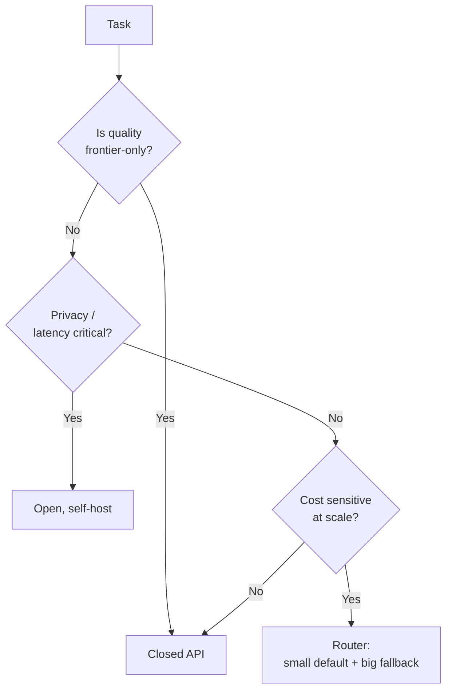

# 🔬 Model Selection — Deep Dive

> "Which model should I use?" is really "which trade-off am I optimizing?"

---

## 1. The four axes

| Axis | Question | How to measure |
|---|---|---|
| **Quality** | Does it solve my task? | Task-specific eval, not leaderboards |
| **Latency** | Fast enough? | p50, p95, p99 tokens/sec; time-to-first-token (TTFT) |
| **Cost** | Cheap enough at scale? | $ per 1M input + output tokens × expected volume |
| **Constraints** | Fits deployment? | Context length, licensing, hosting (SaaS vs open), region, PII |

Never pick on quality alone.

---

## 2. Open vs closed models

| | Closed (GPT-4o, Claude, Gemini) | Open (LLaMA, Mistral, Qwen, DeepSeek) |
|---|---|---|
| Quality | Frontier | Catching up fast (2025+) |
| Cost | Per-token API | Infra + engineering |
| Latency | Network hop | Can be on-device |
| Data privacy | Sent to vendor | Fully local possible |
| Fine-tuning | Limited / paid | Full control (LoRA, QLoRA) |
| Lock-in | High | Low |
| Ops burden | ~zero | Real (GPUs, serving, updates) |

---

## 3. Leaderboards: read with skepticism

- **LMSYS Chatbot Arena** — human preferences, Elo. Best signal, but style-biased.
- **MMLU / MMLU-Pro** — multiple choice knowledge. Contaminated.
- **HumanEval / MBPP** — code. Saturated.
- **GPQA, MATH, AIME** — hard reasoning. Better signal in 2025.
- **BigCodeBench, SWE-bench** — realistic code.
- **Your own eval** — the only one that matters for your app.

Contamination check: search benchmark strings on GitHub / Common Crawl.

---

## 4. Cost math (do it before you build)

```
monthly_cost = (
    requests_per_month
    × (avg_input_tokens × input_price + avg_output_tokens × output_price)
)
```

Example: 1M requests/mo, 2k in + 500 out tokens, GPT-4o ($2.50 in / $10 out per 1M):
$1M \times (2000 \times 2.50 + 500 \times 10) / 10^6 = 1M \times 0.010 = \$10{,}000/\text{mo}$

Switching to GPT-4o-mini (~10× cheaper) → $1k/mo. That's the model-selection decision, before any eval.

---

## 5. The routing pattern

Don't pick *one* model. Route:
- **Cheap/fast model** handles 80% of easy queries.
- **Expensive/smart model** handles 20% (or escalation).
- **Classifier** or heuristic decides.

Frameworks: RouteLLM, Martian, or roll your own with an embedding classifier.

---

## 6. Decision checklist

- [ ] Wrote a 50-example golden set for my task.
- [ ] Benchmarked ≥3 candidate models on it.
- [ ] Measured latency p95, not just mean.
- [ ] Calculated monthly cost at target volume.
- [ ] Checked licensing (commercial use? redistribution?).
- [ ] Considered a router: cheap default + expensive fallback.
- [ ] Documented context length limit and how I'll handle overflow.
- [ ] Have a plan for model deprecation / migration.

---

## 7. Diagram


