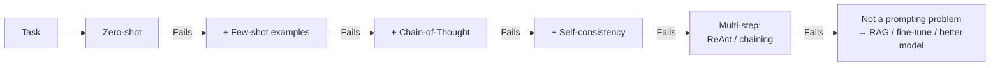

# 🔬 Prompt Engineering — Deep Dive

> The cheapest, fastest way to improve an LLM app. Also the easiest to over-rely on.

---

## 1. Prompt anatomy

```
[System]     Role, constraints, format
[Context]    Retrieved docs, examples, tools
[User]       The actual request
[Assistant]  (Prefill / partial response)
```

Order matters. Most important content should be at the **beginning** or **end** — models suffer from "lost in the middle" (Liu et al. 2023).

---

## 2. Techniques, ranked by evidence

| Technique | When to use | Cost |
|---|---|---|
| **Clear instructions + format spec** | Always | Free |
| **Few-shot examples** | Task shape is unusual | Tokens |
| **Chain-of-Thought** ("think step by step") | Reasoning / math | Latency |
| **Self-consistency** (sample N, majority vote) | Hard reasoning | N× cost |
| **ReAct** (thought → action → observation) | Tool use | Complexity |
| **Tree of Thoughts** | Search-like problems | High cost |
| **Reflexion / self-critique** | Iterative refinement | 2-3× cost |
| **Prompt chaining** | Multi-step tasks | Latency |

Don't jump to CoT for everything — modern models often do it implicitly.

---

## 3. Structured outputs

- **JSON mode** (OpenAI, Anthropic) — guarantees valid JSON.
- **Constrained decoding** — libraries like `outlines`, `jsonformer`, `lm-format-enforcer` mask logits to force schema.
- **Pydantic + instructor** — Python-native structured extraction.

Rule: if you'll parse it, constrain it. Don't rely on "please output JSON."

---

## 4. Reliability tricks

- **Prefill the assistant** (Anthropic) — start the response for it: `{"answer": "`
- **Delimiters** — `<context>...</context>`, XML-ish tags help models attend correctly.
- **Negative constraints work poorly** — say what to do, not what not to do.
- **Explicit refusal path** — "If unsure, say 'I don't know'."
- **Repeat critical instructions** at start and end for long contexts.

---

## 5. Prompt injection & security

- **Direct injection** — user says "ignore previous instructions."
- **Indirect injection** — malicious content in retrieved docs / tool outputs.
- **Data exfiltration** — model tricked into leaking system prompt or secrets.

Defenses:
- Treat model output as **untrusted input** for the next hop.
- Never mix instructions with tool output in the same "trust zone."
- Sandbox tools (no arbitrary shell / SQL).
- Use separate models: one plans, one executes with limited scope.
- Log everything.

Read: Simon Willison's blog on prompt injection.

---

## 6. Prompt engineering as engineering

- **Version control prompts** — treat them as code (git, PR review).
- **Eval every change** — even "small" wording tweaks regress.
- **Template with variables** — Jinja, or a purpose-built lib (`priompt`, `dspy`).
- **A/B test in prod** with feature flags.
- **Meta-prompting / auto-prompting** — DSPy optimizes prompts from data.

---

## 7. When to stop prompting and start doing something else

- You've spent >1 week on prompts → try RAG.
- Prompt is >3k tokens with brittle logic → try fine-tuning.
- You need reliable structured output → constrained decoding.
- Latency is killing UX → smaller model + better prompt.

---

## 8. Diagram


