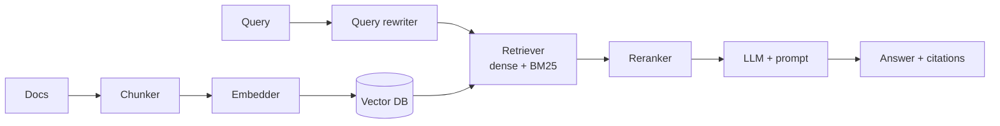

# 🔬 RAG — Deep Dive

> Retrieval-Augmented Generation. The #1 pattern in real-world LLM apps.

---

## 1. Why RAG

LLMs have three limits RAG addresses:
1. **Stale knowledge** (training cutoff).
2. **Private data** (your docs).
3. **Context window** (can't cram everything).

RAG = "look up relevant docs, then answer with them in context."

---

## 2. The pipeline

Every arrow is a place quality can die.

---

## 3. Chunking

- **Fixed-size** — simple, brittle.
- **Recursive character** — split by paragraphs → sentences → chars.
- **Semantic** — split at embedding-similarity breakpoints.
- **Layout-aware** — respect headings, tables, code blocks (unstructured, LlamaParse).
- **Small-to-big** — embed small chunks, retrieve, then expand to parent chunk.
- **Hierarchical / summary** — index summaries + raw text at multiple levels.

Rule: chunk size 200-800 tokens, with ~10-20% overlap. Test on your data.

---

## 4. Embeddings

- **Dense** (semantic) — `text-embedding-3-large`, `bge-large`, `nomic-embed`. Good at meaning, bad at exact terms.
- **Sparse** (BM25) — good at exact terms (names, IDs, code).
- **Hybrid** — combine dense + sparse with reciprocal rank fusion (RRF). Almost always wins.
- **Late interaction** (ColBERT) — token-level matching. Slower, more accurate.
- **Matryoshka** — variable-dimension embeddings for cheap approximate search.

Benchmark: [MTEB leaderboard](https://huggingface.co/spaces/mteb/leaderboard).

---

## 5. Retrieval enhancements

- **Query rewriting** — LLM turns "what did we ship last week?" into a search query.
- **HyDE** — LLM writes a hypothetical answer, embed *that*.
- **Multi-query** — generate 3-5 variants, union results.
- **Reranker** — cross-encoder (BGE-reranker, Cohere Rerank) rescoring top-k. Big quality win.
- **Metadata filtering** — date, source, permissions. Never skip this.

---

## 6. Advanced patterns

- **Agentic RAG** — LLM decides when/what to retrieve, can iterate.
- **GraphRAG** (Microsoft) — build entity graph over corpus, retrieve subgraphs. Good for global questions.
- **Contextual retrieval** (Anthropic) — prepend LLM-generated context to each chunk before embedding. +49% on their bench.
- **Corrective RAG (CRAG)** — grade retrieved docs, re-search if bad.
- **Self-RAG** — model emits reflection tokens deciding to retrieve.

---

## 7. Evaluation (see also 02-evaluation)

RAG has two eval axes:
- **Retrieval** — did we fetch the right docs? Recall@k, MRR, nDCG.
- **Generation** — is the answer faithful and relevant? RAGAS metrics:
  - Faithfulness — claims supported by context.
  - Answer relevancy — does it answer the question.
  - Context precision — top-k mostly relevant.
  - Context recall — needed info actually retrieved.

Build a small labeled Q/A/context set. Iterate.

---

## 8. Common failure modes

- Chunks too big → irrelevant context dilutes attention.
- Chunks too small → missing surrounding info.
- No hybrid search → misses exact-term queries.
- No reranker → top-k has irrelevant docs.
- No metadata filter → user sees other tenants' data (security!).
- Embedding model mismatch → indexed with model A, querying with B.
- Ignoring update cost — re-embedding a 10M doc corpus is expensive.

---

## 9. Vector DBs

| Option | When |
|---|---|
| **pgvector** | You already have Postgres, <10M vectors |
| **Qdrant / Weaviate / Milvus** | Purpose-built, filtering, hybrid |
| **Pinecone** | Managed, no ops |
| **LanceDB / Chroma** | Local, embedded |
| **Elasticsearch / OpenSearch** | Already have it, hybrid built-in |
| **FAISS** | Library, not a DB. Fast, no metadata |
