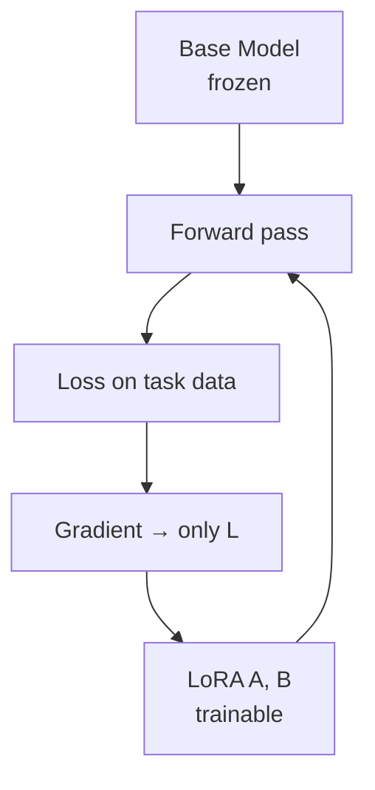

# 🔬 Fine-Tuning — Deep Dive

> Modify the model's weights for your task. Powerful, but often overkill.

---

## 1. Do you actually need it?

Try in this order:
1. Better prompt.
2. Few-shot examples.
3. RAG.
4. A stronger model.
5. **Then** fine-tune.

Fine-tune when:
- You need a **specific style/format** at high volume.
- You have **hundreds+ high-quality examples** unavailable to closed models.
- **Latency/cost** requires a smaller model matching a bigger one.
- You want to **compress a system prompt** into weights.

Don't fine-tune to add facts — that's what RAG is for. Fine-tuning is bad at fact injection and prone to hallucination.

---

## 2. Types of tuning

| Type | Data | Purpose |
|---|---|---|
| **Continued pretraining** | Raw text | Domain adaptation (medical, legal) |
| **Supervised fine-tuning (SFT)** | (prompt, response) pairs | Task/style |
| **Instruction tuning** | Diverse (instruction, response) | Generalist assistant |
| **Preference tuning** (RLHF, DPO, KTO, ORPO) | (prompt, chosen, rejected) | Align to preferences |
| **Distillation** | Big-model outputs | Small model mimics big |

---

## 3. PEFT — Parameter-Efficient Fine-Tuning

Full fine-tuning of a 7B model needs ~80GB VRAM. PEFT makes it fit on a laptop.

- **LoRA** — inject low-rank matrices $A, B$ into weights: $W' = W + BA$ where $\text{rank}(BA) = r \ll d$. Train only $A, B$ (~0.1-1% of params).
- **QLoRA** — quantize base model to 4-bit (NF4), LoRA on top. 7B fits in ~10GB.
- **DoRA** — decompose weight into magnitude + direction, better than LoRA on some tasks.
- **Adapters** — small MLP inserted between layers (older).
- **Prompt/prefix tuning** — learn soft prompts. Cheaper, less effective.

Rules of thumb (LoRA):
- rank `r` = 8-64. Higher for harder tasks.
- `alpha` = 2 × `r` is a common start.
- Target `q_proj`, `v_proj` at minimum; all linear layers for max quality.
- Learning rate ~1e-4 to 3e-4.

---

## 4. Preference tuning

- **RLHF** (PPO) — reward model + RL. Powerful, unstable, expensive.
- **DPO** (Direct Preference Optimization) — reformulates RLHF as a classification loss. No reward model. Now the default.
- **KTO** — only needs (prompt, response, thumbs-up/down). No pairs required.
- **ORPO** — combines SFT + preference in one loss.
- **IPO** — fixes DPO overfitting.

You need clean preference pairs. 1-10k is typical.

---

## 5. Data

Data quality dominates everything.

- **Diversity** > quantity. 1k great examples > 100k noisy ones (LIMA paper).
- **Format** — match your inference-time prompt exactly.
- **Deduplicate** — near-dupes hurt.
- **Balance** — check task/topic distribution.
- **Split** — never train on eval data. Sounds obvious, still happens.

Synthetic data:
- Use a strong model (GPT-4, Claude) to generate.
- **Filter aggressively** — self-instruct produces junk.
- Watch licensing (OpenAI TOS prohibits training competitors).

---

## 6. Evaluation for fine-tunes

- **Task metric** on held-out set.
- **Regression checks** — did general capability drop? Run MMLU/GSM8K etc.
- **Catastrophic forgetting** — model loses skills it had. Mix in general data during SFT.
- **Overfitting** — validation loss up while training loss down. Early stop.

---

## 7. Stack

- **Base models** — Llama 3.x, Qwen 2.5, Mistral, Gemma.
- **Libraries** — `transformers`, `peft`, `trl`, `axolotl` (config-driven), `unsloth` (2x faster).
- **Data** — `datasets` (Hugging Face), `distilabel` for synthesis.
- **Serving** — `vLLM`, `TGI`, `SGLang`, `Ollama`, `llama.cpp`.
- **Managed** — Together, Fireworks, Modal, RunPod for GPUs.

---

## 8. Cost sanity check

- QLoRA on 7B, 10k examples, single A100 40GB → few hours, <$20 rented.
- Full FT of 70B → many GPU-days. Usually not worth it vs LoRA of 70B.

---

## 9. Diagram

