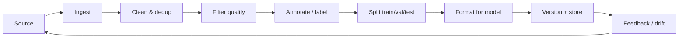

# 🔬 Dataset Engineering — Deep Dive

> "Garbage in, garbage out" — but scaled by billions of tokens. The most underrated skill.

---

## 1. The data lifecycle

Each stage has failure modes and metrics.

---

## 2. Sourcing

- **Public web** — Common Crawl, C4, FineWeb. Massive, noisy.
- **Curated** — Wikipedia, arXiv, StackExchange, GitHub.
- **Licensed** — books, publishers, code (careful).
- **Synthetic** — strong-model outputs. Cheap, biased toward that model.
- **Human-generated** — your users, your annotators. Highest signal.
- **Preference data** — thumbs, comparisons, edits.

Legal: respect licenses, robots.txt, copyright, GDPR. Data provenance is now a compliance topic.

---

## 3. Cleaning & deduplication

- **Exact dedup** — hash lines/docs. Easy win.
- **Near-dedup** — MinHash + LSH (SlimPajama, DataTrove). ~10-30% of web is near-dupes.
- **Boilerplate removal** — nav bars, cookie banners.
- **PII scrubbing** — regex + NER (emails, phones, SSNs).
- **Language ID** — fastText / cld3 filters.
- **Toxicity filter** — Detoxify, Perspective API. Careful: over-filtering hurts diversity.

---

## 4. Quality filtering

Signals:
- **Perplexity** under a reference model (low PPL = "well-formed").
- **Classifier** trained on curated vs random web (GPT-3, LLaMA use this).
- **Heuristics** — word count, symbol ratio, repetition rate, stopword density.
- **Educational value** classifier (FineWeb-Edu).
- **Deduplicate again** after filtering.

Big lesson from FineWeb / RefinedWeb: careful filtering of Common Crawl beats using "high-quality" corpora.

---

## 5. Annotation

- **Guidelines** — write them, iterate them, version them.
- **Inter-annotator agreement** — Cohen's κ > 0.6 minimum. Below that, task is ill-defined.
- **Pilot** — 100 examples, calibrate, then scale.
- **Quality control** — gold questions, review sample, disagreement adjudication.
- **Tools** — Label Studio, Argilla, Prodigy, Doccano.

For LLM outputs: humans compare pairs (chosen/rejected) faster than writing rubrics.

---

## 6. Synthetic data — the 2024-2026 wave

- **Self-Instruct / Alpaca** — seed prompts → LLM expands.
- **Evol-Instruct** — iteratively make prompts harder.
- **Textbooks Are All You Need** (Phi) — synthetic "textbook" pretraining data.
- **Constitutional AI** — critique + revise with principles.
- **Persona-driven** (PersonaHub) — 1B personas × prompts → diversity.
- **Distillation** — capture strong model behavior into small model.

Watchouts: mode collapse, factual drift, license restrictions on outputs, evaluation contamination.

---

## 7. Data for RAG

Different problem: not training data, but **retrieval corpus quality**.

- Parse layout well (tables, code, images).
- Enrich with metadata (source, date, permissions, author).
- Deduplicate at chunk level.
- Track document versioning — stale docs = wrong answers.

---

## 8. Data governance

- **Provenance** — where did each row come from?
- **Versioning** — DVC, LakeFS, or `datasets` versions.
- **Access control** — who can read? Train on?
- **Consent + opt-out** — increasingly required.
- **Bias audits** — demographic, geographic, temporal.
- **Retention** — right to erasure.

---

## 9. Quick heuristics

- 1k great > 100k mid > 1M noisy.
- Dedup before quality filter, then dedup again.
- Match training format to inference format exactly.
- Always hold out an eval set the model *cannot* have seen.
- Log every data change — it will affect model behavior.
