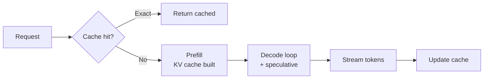

# 🔬 Inference Optimization — Deep Dive

> Make it faster and cheaper without losing quality. Where systems engineering meets ML.

---

## 1. What "slow" means

Two metrics that matter:
- **TTFT** (Time To First Token) — how long until *anything* shows up. Dominated by **prefill** (encoding the prompt).
- **TPOT** (Time Per Output Token) — steady-state generation speed. Dominated by **decode**.

Also:
- **Throughput** — tokens/sec across all users (server-side).
- **p95 latency** — tail matters more than average.
- **$/1M tokens** — the business metric.

---

## 2. Where time goes

For each token in decode, the model reads **all** weights from HBM. Decoding is **memory-bandwidth bound**, not compute-bound. That's why:
- GPUs with more HBM bandwidth (H100 > A100) speed up decode.
- Quantization helps a lot (less to read).
- Larger batches help throughput but not per-user latency.

---

## 3. KV cache — the key optimization

Attention over past tokens is expensive. Cache computed K, V per token:
- Memory: $2 \times L \times H \times d_{\text{head}} \times n_{\text{tokens}}$ per layer.
- Grows linearly with context. Quickly dominates memory at long context.

Optimizations:
- **PagedAttention** (vLLM) — virtual-memory-style paging. No fragmentation. Massive throughput win.
- **KV cache quantization** — INT8 / FP8 K,V. Small quality hit.
- **Multi-Query / Grouped-Query Attention (MQA/GQA)** — share K,V across heads. Llama 2/3 use GQA.
- **Sliding window / StreamingLLM** — keep only recent + attention sinks.
- **Prompt caching / prefix caching** — reuse KV for repeated system prompts (Anthropic, DeepSeek).

---

## 4. Quantization

Reduce weight precision:
- **FP16 / BF16** → default training precision.
- **INT8** — 2× smaller, tiny quality loss.
- **INT4** (GPTQ, AWQ, bitsandbytes NF4) — 4× smaller, real quality trade-off.
- **FP8** (H100, Blackwell) — hardware-supported, near-lossless.
- **Weight + activation quant** (SmoothQuant, W4A8) — harder, bigger wins.

Rule: try INT8 first, benchmark. INT4 for edge devices or extreme cost pressure.

---

## 5. Decoding tricks

- **Speculative decoding** — small "draft" model proposes N tokens, big model verifies in one pass. 2-3× speedup, exact same distribution.
- **Medusa / EAGLE** — attach prediction heads to the model itself.
- **Continuous batching** — new requests join mid-batch (vLLM, TGI). Huge throughput lift.
- **Chunked prefill** — mix prefill and decode to reduce TTFT under load.
- **FlashAttention 2/3** — fused, IO-aware attention kernel. 2-4× faster attention.

---

## 6. Model-level

- **Distillation** — smaller student mimics teacher.
- **Pruning** — remove low-importance weights (structured for real speedup).
- **MoE** (Mixture of Experts) — Mixtral, DeepSeek. Total params big, active params small. Great quality/cost.
- **Smaller architecture** — Mamba, RWKV, hybrid transformers. Linear-time inference.

---

## 7. Serving

Recommended stack (2025):
- **vLLM** — throughput king, PagedAttention, prefix caching, spec decoding.
- **SGLang** — great for structured / chained calls, RadixAttention.
- **TensorRT-LLM** — NVIDIA-optimized, hardest to use.
- **TGI** — Hugging Face, good defaults.
- **Ollama / llama.cpp** — local / edge / CPU.

Managed: Together, Fireworks, Anyscale, Replicate, Modal.

---

## 8. Caching layers

- **Exact prompt cache** — memoize (prompt, params) → response.
- **Semantic cache** — embedding-similar prompts hit cache (GPTCache).
- **Prefix cache** — vendor-side (Anthropic 90% discount, DeepSeek).
- **Retrieval cache** — cache embedding + top-k results.

Semantic caching sounds great but can silently return wrong answers. Add a confidence threshold + eval.

---

## 9. Cost levers (in rough order)

1. Use a smaller model where possible (router).
2. Prompt caching (biggest free win for chatty apps).
3. Shorten prompts / outputs.
4. Batch async requests.
5. Quantize (self-hosted).
6. Speculative decoding.
7. MoE or distilled model.
8. Move to your own infra only if volume justifies.

---

## 10. Diagram

