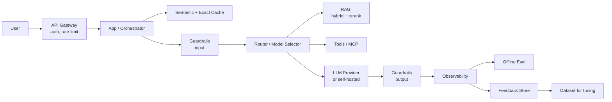
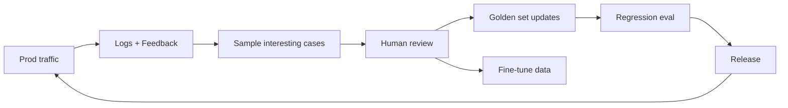

# 🔬 Architecture — Deep Dive

> Stitching everything into a production system that survives contact with real users.

---

## 1. The reference architecture

Nine capabilities every real app needs. Missing any = a bug waiting to happen.

---

## 2. The nine capabilities

| # | Capability | Why |
|---|---|---|
| 1 | **Gateway** (auth, rate limit, quotas) | Abuse, cost blow-ups |
| 2 | **Guardrails** (input + output) | PII, prompt injection, toxicity, jailbreaks |
| 3 | **Router / model selector** | Cost + quality trade-off |
| 4 | **Context (RAG / tools / memory)** | Actual capability |
| 5 | **Caching** | Cost + latency |
| 6 | **Observability** (traces, prompts, tokens, cost) | Debug, cost tracking |
| 7 | **Evaluation** (offline + online) | Regression detection |
| 8 | **Feedback loop** | Continuous improvement |
| 9 | **Deployment + versioning** (prompts, models, tools) | Safe rollouts |

---

## 3. Guardrails

**Input**
- PII detection (Presidio).
- Prompt injection detectors (Rebuff, LlamaGuard, PromptGuard).
- Rate limits per user/tenant.
- Content policy classifier.

**Output**
- Structured output validation (schema).
- Hallucination checks (RAG faithfulness).
- Toxicity / PII redaction.
- Business rule checks (no prices below cost, etc).

Fail-open vs fail-closed: choose per risk level, document, test.

---

## 4. Observability

Log every request with:
- Full prompt (redacted PII) and response.
- Model, version, params (temperature, tools).
- Retrieved chunks (IDs).
- Tokens in/out, cost, latency (TTFT + total).
- User + session IDs.
- Feedback (thumbs, edit, retry).

Tools: LangSmith, Langfuse, Arize Phoenix, Helicone, W&B Weave, Braintrust.

Traces > logs. LLM apps are DAG-shaped.

---

## 5. Deployment patterns

- **Blue/green** for prompt changes.
- **Canary** for model swaps (1% → 10% → 100%).
- **Shadow** — new model receives requests, output not returned to user, compared offline.
- **Feature flags** for tools/prompts.
- **Kill switch** — one flag disables model calls, returns fallback.

Never deploy prompt changes without an eval run.

---

## 6. Reliability

- **Retries** — exponential backoff on 429/503.
- **Timeouts** — per call and end-to-end.
- **Fallbacks** — cheaper model, cached answer, canned response.
- **Circuit breakers** — stop hammering a broken provider.
- **Idempotency keys** — for user-facing actions.
- **Multi-provider** — LiteLLM, OpenRouter for portability.

---

## 7. Security-specific

- **Tenant isolation** in retrieval (metadata filter, per-tenant index).
- **Prompt secret hygiene** — never put keys in prompts.
- **Tool sandboxing** — Python in Firecracker/gVisor, not `os.system`.
- **Egress control** — LLM shouldn't fetch arbitrary URLs.
- **Model output → next step** = untrusted input.
- **Audit log** for high-risk actions.

---

## 8. Cost governance

- Per-tenant quotas + per-request budgets.
- Alert on 3σ cost anomalies.
- Track $/user, $/session, $/task.
- Cache hit rate as a first-class metric.
- Nightly cost report to engineering channel.

---

## 9. The feedback flywheel

The teams that ship the fastest are the ones with the tightest loop.

---

## 10. Anti-patterns

- No eval before shipping prompt changes.
- Logging prompts but not retrieved context (can't reproduce).
- One giant prompt doing everything.
- Model provider hardcoded, no abstraction.
- No cost dashboard until the bill arrives.
- Guardrails only on input, not output.
- Same tenant sees another's cached response.

---

## 11. Reading

- Anthropic — *Building Effective Agents*.
- Chip Huyen — *Designing ML Systems* (still gold for MLOps).
- Eugene Yan — *Patterns for Building LLM-Based Systems & Products*.
- Hamel Husain — *Evals blog series*.
- OpenAI Cookbook — production patterns.
