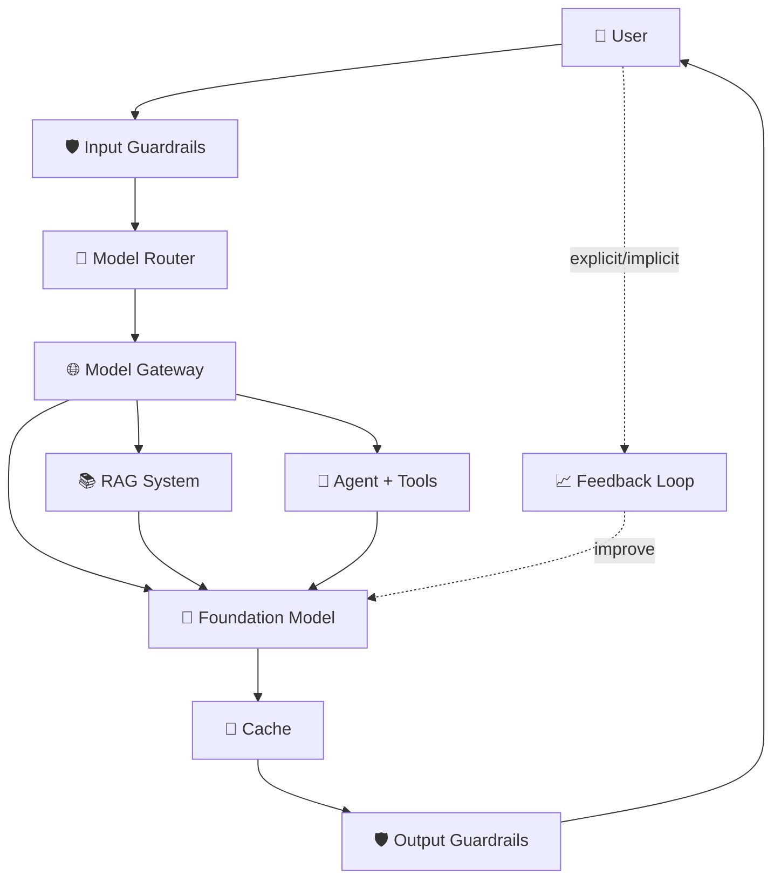

# 🏗️ Complete AI Application Architecture

> How all the pieces fit together in a real, production-ready AI app.

## The Simplest App

```
User → Model → Response
```

That's it. Just call an API. But real apps grow past this quickly...

## Evolution Stages

### Stage 1: Add Context Construction

Give the model access to the info it needs:
- **RAG** — search your knowledge base
- **Agent tools** — external APIs, web search
- **Document uploading** — analyze user files

### Stage 2: Add Guardrails

Protect the system and users.

- **Input guardrails** — block PII leaks, malicious prompts
- **Output guardrails** — catch quality failures (empty, wrong format, false info) + security failures (toxic content, PII exposure)

⚠️ Balance protection vs. UX (overly strict = frustrating).

### Stage 3: Model Routing & Gateway

**Model Router** — intent classifier sends query to the right model/pipeline.

**Model Gateway** — unified layer for:
- Access to multiple models
- Access control & cost management
- Fallback policies (rate limits, failures)
- Load balancing
- Logging & analytics

Benefit: **change API providers by updating the gateway, not every app.**

### Stage 4: Caching

- **Inference caching** — KV cache (attention), prompt cache (common segments)
- **Storage options** — in-memory (fast, small) → PostgreSQL/Redis (large)
- **Eviction policies** — LRU (least recently used), LFU (least frequently used)

### Stage 5: Complex Logic & Write Actions

- Multi-step reasoning flows
- Agentic loops with decisions
- Write actions (send emails, place orders) — ⚠️ high risk

## Full Architecture



## Monitoring vs. Observability

- **Monitoring** — tracks external outputs (something broke!)
- **Observability** — internal state visibility (WHY it broke)

### Key Metrics
- **MTTD** — Mean Time To Detection
- **MTTR** — Mean Time To Response
- **CFR** — Change Failure Rate

**Golden rule:** log everything.

## Orchestrators

Tools that manage the whole pipeline:
- **LangChain**
- **LlamaIndex**
- **Flowise**
- **Langflow**
- **Haystack**

⚠️ Start **without** an orchestrator to understand basics first.

## User Feedback = Gold

Your biggest competitive advantage — everyone has the same models, only you have your users' interactions.

### Explicit Feedback
- Thumbs up/down
- Star ratings
- Written comments

### Implicit Feedback
- Early termination (user gave up)
- Error corrections
- Question clarifications ("what I meant was...")
- Complaint sentiment
- Regeneration frequency
- Conversation length

### When to Ask
- ✅ Start of experience (skill level, preferences)
- ✅ When something unexpected happens
- ✅ Natural decision points (A vs. B comparison)
- ❌ Not too often — creates friction

## Guiding Principle

> **Complexity should serve a purpose.**
> Only add components that solve real problems. A simple, reliable app > a complex, brittle one.

📖 [Back to book summary](../00-book-overview/summary.md)
